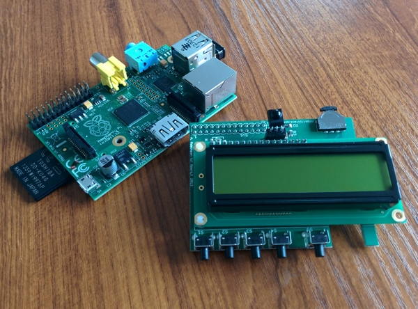
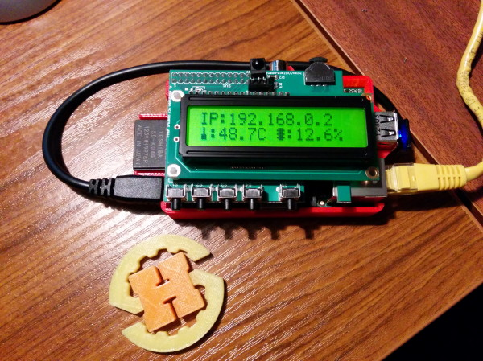
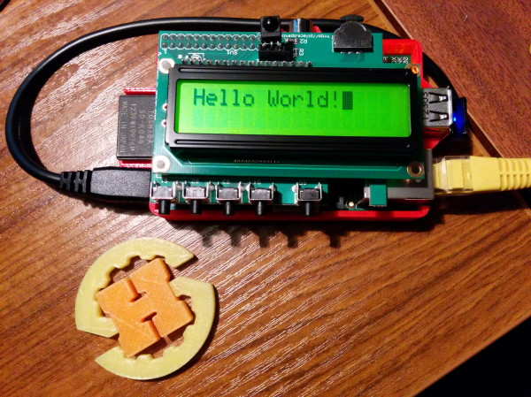
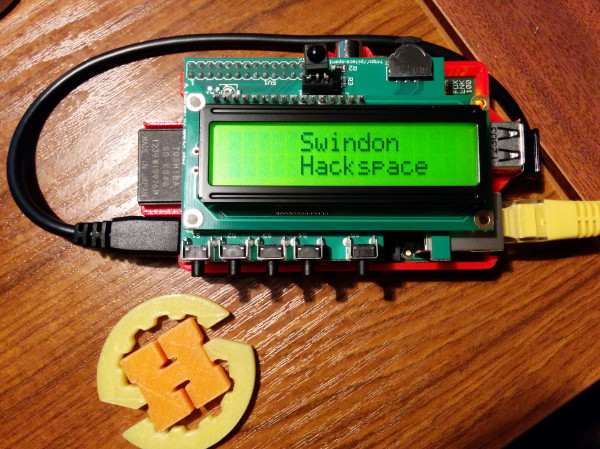
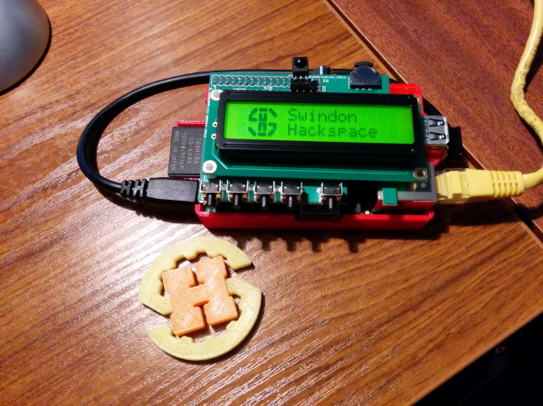

title:        PiFace Control And Display Board
subtitle:     Getting started with the PiFace LCD
categories:   projects
author:       Robert Longbottom
image:        HelloWorld.jpg
date:         2014-05-08 17:20
discuss:      ywV59enffto

The Hackspace recently took delivery of a 
[PiFace Control and Display board from Farnell](http://uk.farnell.com/piface/piface-control-display/i-o-board-with-lcd-display-for/dp/2344458).
It is an add-on board for the Raspberry Pi that includes a 16 character by 2 line
display, five push buttons, a toggle button and an IR receiver.  The 
intention is to use this on the Hackspace 3D printer to display some information
about the printer (bed and extruder temperatures) and about the job (percent
complete).  It would also be nice to use the buttons to control some of the 
functions of the printer such as priming the extruder.

In this post I'll cover what I did to get up and running with the PiFace.  This
was really just a learning exercise to understand how it works and what can be
done.  There will be another post about getting it working with the 3D printer
later on.

<!-- more -->




## Getting The Raspberry Pi Ready

There is a nice guide on getting everything setup on the [PiFace website](http://www.piface.org.uk/guides/setting_up_pifacecad/)
so I won't go into every detail again.  In short:

- Updated the Raspbian install on our Raspberry Pi by running 
`apt-get update && apt-get upgrade`  This took some hours, must have 
been quite a while since we did it!

- Enabled SPI using `raspi-config`.  What this actually seems to do is make 
sure the spi kernel module is installed.

```sh
pi@raspberrypi ~ $ lsmod |grep spi
regmap_spi              1897  1 snd_soc_core
spi_bcm2708             4728  0
```

- Installed the PiFace Python modules `apt-get install python3-pifacecad`.
It's nice that it is included in the Raspbian repos and can be installed so easily.

## First Test

The best idea is always to test using some code written by someone else
so that you know you have everything setup correctly.  Fortunately there is
a nice sysinfo sample provided.

```sh
pi@raspberrypi ~ $ python3 /usr/share/doc/python3-pifacecad/examples/sysinfo.py
```



That works perfectly.  Time to dive into python and see what the api is like.

## Hello World Using The Python Shell

```py
pi@raspberrypi ~ $ python3
Python 3.2.3 (default, Mar  1 2013, 11:53:50)
[GCC 4.6.3] on linux2
Type "help", "copyright", "credits" or "license" for more information.
>>> import pifacecad as p
>>> cad = p.PiFaceCAD()
>>> cad.lcd.backlight_on()
>>> cad.lcd.write("Hello World!")
```



Pretty simple!  It took me much longer than this to get one of these
displays working on Arduino the first time I tried it.  But a lot of 
that was sorting out the wiring!  Thats one good reason to get a 
PiFace instead of wiring up your own display.

## Something A Bit Fancier

Ok, let's try something a bit more tricky.  There are api commands to
move the cursor around and to hide the cursor, so let's have a go with those.

```py
pi@raspberrypi ~ $ python3
Python 3.2.3 (default, Mar  1 2013, 11:53:50)
[GCC 4.6.3] on linux2
Type "help", "copyright", "credits" or "license" for more information.
>>> import pifacecad as p
>>> cad = p.PiFaceCAD()
>>> cad.lcd.backlight_on()
>>> cad.lcd.clear()
>>> cad.lcd.set_cursor(5,0)
>>> cad.lcd.write("Swindon")
>>> cad.lcd.set_cursor(5,1)
>>> cad.lcd.write("Hackspace")
>>> cad.lcd.cursor_off()
>>> cad.lcd.blink_off()
```

A few points to note here.  For the non-programmers out there, computers count 
from zero, so "5" is actually the 6th position along and "0" is the first row. 
Interesting that you have to call both `cursor_off()` and `blink_off()` to totally 
get rid of the cursor, but that could be useful in certain situations.



## Custom Bitmaps

It would be nice if I could get the Swindon Hackspace logo on there too 
using the custom bitmap support.  From the 
[documentation](http://piface.github.io/pifacecad/creating_custom_bitmaps.html)
it doesn't look too difficult,  there is a [page for generating the codes](http://www.quinapalus.com/hd44780udg.html) 
to create characters that is linked to from the documentation.  If you're familiar with
setting bits in bytes it's fairly easy to see what is going on; if you want the
right most pixel to be on, add 1, the second from the right, add 2, third
from the right add 4, fourth from the right, add 8, fifth from the right
add 16.  Do this for each line and you have the 8 values you need to pass 
into the `LCDBitmap()` function.

However there isn't really enough room to get the hackspace logo in a single 
character so let's try using more than one.  No mention of how many custom 
characters you are allowed in the PiFace docs, but the designer page about 
the HD44780 says you can have up to eight.  If we had 3x2 that would give us 
(5+5+5) x (8+8) = 15x16 pixels to play with.  That's a nice square-ish shape and 
uses 6 custom characters so could work.  

I created a new image in Gimp that is 15x16 pixels, zoom in to 1600% and 
started designing by filling in pixels.  I then "split" this into six by using
the select tool to draw round each group of 5x8 pixels and copied it into
the online designer to generate the codes.  Lazy I know, I could work out
those numbers myself!

My first attempt didn't look so great because of where the physical gaps 
between the characters on the display fell, but a bit of tweaking and I ended 
up with something like this:

```py
>>> sh = p.LCDBitmap([3,7,14,12,24,24,31,31])
>>> cad.lcd.store_custom_bitmap(0, sh)
>>> sh = p.LCDBitmap([31,31,0,27,27,27,31,31])
>>> cad.lcd.store_custom_bitmap(1, sh)
>>> sh = p.LCDBitmap([24,28,14,7,3,0,0,0])
>>> cad.lcd.store_custom_bitmap(2, sh)
>>> sh = p.LCDBitmap([0,0,0,24,28,14,7,3])
>>> cad.lcd.store_custom_bitmap(3, sh)
>>> sh = p.LCDBitmap([31,31,27,27,27,0,31,31])
>>> cad.lcd.store_custom_bitmap(4, sh)
>>> sh = p.LCDBitmap([31,31,3,3,6,14,28,24])
>>> cad.lcd.store_custom_bitmap(5, sh)
```

That code loads six custom characters into memory locations zero to five.
Now all we need to do is write them out to the display.  It might be wise 
to turn the cursor back on at this point to see where we are writing to:

```py
>>> cad.lcd.cursor_on()
>>> cad.lcd.blink_on()
>>> cad.lcd.set_cursor(1,0)
```

Note that the cursor doesn't reappear until you move it somewhere. Time 
to write out the logo and finally hide the cursor again.

```py
>>> cad.lcd.write_custom_bitmap(0)
>>> cad.lcd.write_custom_bitmap(1)
>>> cad.lcd.write_custom_bitmap(2)
>>> cad.lcd.set_cursor(1,1)
>>> cad.lcd.write_custom_bitmap(3)
>>> cad.lcd.write_custom_bitmap(4)
>>> cad.lcd.write_custom_bitmap(5)
>>>
>>> cad.lcd.cursor_off()
>>> cad.lcd.blink_off()
```



A pretty pleasing result for an hour of playing around in the Python
shell.

Interestingly, if you redefine one of the custom bitmaps by calling 
`store_custom_bitmap()` while it is on the display, it changes immediately 
without you having to rewrite it using `write_custom_bitmap()`.  This 
could be a neat way to have animated characters.  It does mean that 
you really are limited to the 8 it supports though, and you can't 
"cheat" by defining one, writing it to the display and then re-defining it.

## Errors

If you do try to access or create more custom bitmaps than you should 
you get a nice friendly error message, which is good to know.  It's always
reassuring that a library is decently written when it provides nice error
messages.

```py
>>> cad.lcd.write_custom_bitmap(8)
Traceback (most recent call last):
  File "<stdin>", line 1, in <module>
  File "/usr/lib/python3/dist-packages/pifacecad/lcd.py", line 458, in write_custom_bitmap
	self.char_bank_in_range_or_error(char_bank)
  File "/usr/lib/python3/dist-packages/pifacecad/lcd.py", line 492, in char_bank_in_range_or_error
	cgramaddr=char_bank,
Exception: There are only 8 custom characters (You tried to access 8).

>>> cad.lcd.store_custom_bitmap(8, sh)
Traceback (most recent call last):
  File "<stdin>", line 1, in <module>
  File "/usr/lib/python3/dist-packages/pifacecad/lcd.py", line 474, in store_custom_bitmap
	self.char_bank_in_range_or_error(char_bank)
  File "/usr/lib/python3/dist-packages/pifacecad/lcd.py", line 492, in char_bank_in_range_or_error
	cgramaddr=char_bank,
Exception: There are only 8 custom characters (You tried to access 8).
```

## And Finally...

Given I only know the basics in Python (though I do code in other languages)
it's pretty easy to get started with the PiFace and make it do some cool stuff.
It seems like it should be fairly easy to get it doing something useful with
the 3D printer.  More on that later....

Thanks go to [Farnell / Element14](http://uk.farnell.com/) for supplying the PiFace
Control and Display board.


